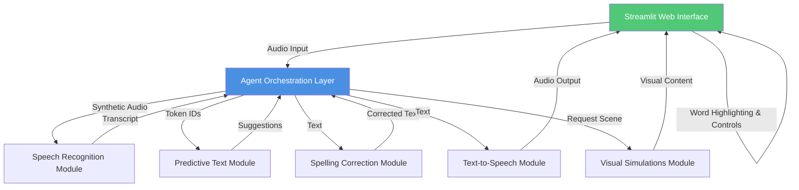

# Agentic AI Supports Special Needs Education

This project is a small, runnable demo of agentic AI supports for learners with diverse needs. It includes toy neural models for speech recognition, predictive text, spelling correction, and text-to-speech, plus a minimal Streamlit interface with word highlighting and audio playback.

## Features

- Toy speech recognition that maps synthetic audio to short phrases.
- Predictive text with a tiny LSTM model trained on dummy sentences.
- Spelling correction using a lexicon and close-match correction.
- Text-to-speech using Google TTS (human voice) with audio playback in the UI.
- Word highlighting and replay controls in the Streamlit interface.
- Visual simulation placeholder for concept learning scenes.

## System Architecture



**Component Overview:**

- **Speech Recognition Module**: Converts synthetic audio into text using a toy CNN-BiGRU model
- **Predictive Text Module**: Uses a small LSTM to suggest next words based on context
- **Spelling Correction Module**: Detects and corrects errors using lexicon-based matching
- **Text-to-Speech Module**: Produces human voice audio via Google TTS API
- **Visual Simulations Module**: Provides interactive concept learning scenes
- **Agent Orchestration Layer**: Coordinates all modules and manages data flow

## Requirements

- Python 3.10+
- Internet access for gTTS (Google Text-to-Speech)

Install dependencies:

```bash
pip install -r requirements.txt
```

## Run the demo

### Web interface (recommended)

```bash
streamlit run app.py
```

Open the app at:

```
http://localhost:8501
```

### CLI demo

```bash
python src/main.py
```

## Notes

- The models are toy examples and train on dummy data to keep the demo fast.
- Checkpoints are saved in the `checkpoints/` folder to avoid retraining every run.
- gTTS uses a network call to generate audio; if offline, TTS will fall back to silence.

## Project structure

- `app.py` - Streamlit UI
- `src/agentic_ai.py` - Agent orchestration
- `src/models/` - Toy models and real TTS wrapper
- `src/visuals/` - Visual simulation placeholders
- `src/utils/` - Config and constants